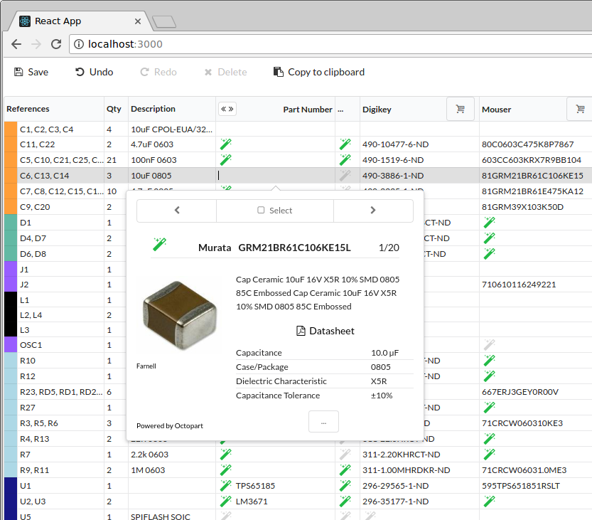

# Kitspace BOM Builder

This is currently a prototype of a bill of materials editor meant to make it as easy as possible to design in and document the parts needed for an electronics project.  Once this is usable it will be integrated into [Kitspace.org](https://kitspace.org).

The back-end for this project is [Partinfo](https://github.com/monostable/kitspace-partinfo). This project was bootstrapped with [Create React App](https://github.com/facebookincubator/create-react-app) so check out [their documentation](https://github.com/facebook/create-react-app/blob/master/packages/react-scripts/template/README.md) on how to perform common taks.



To get started, set up NodeJS, then run partinfo and then:

```
npm install && npm run start
```
